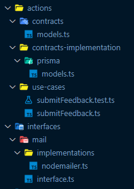
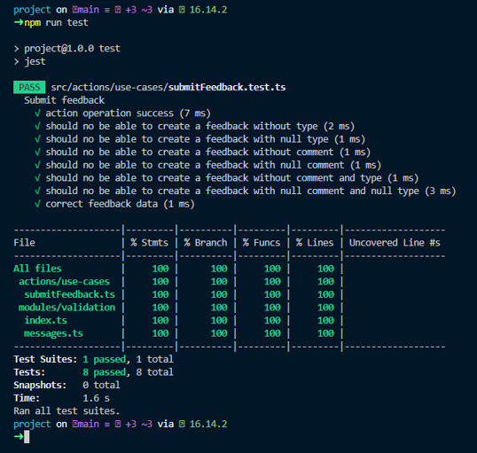

<h1>Feedget - Backend com Node</h1>
<p align="center">
<a href="#tools">Ferramentas</a> • 
<a href="#routes">Rotas</a> • 
<a href="#study">Aprendizado</a> • 
<a href="#tests">Testes</a>
</p>
<p>Projeto da nlw ( evento da Rocketseat ), o frontend foi feito react, que consome uma api do backend em node. Esta aplicação consiste num widget que envia para os devs um feedback do usuário que poder ser um bug, uma ideia ou qualquer outra coisa. Este projeto está hospeadado na Railway, acesse em <a href="https://feedget-backend-node-production.up.railway.app/">https://feedget-backend-node-production.up.railway.app/</a>.</p>

<br>
<h2 id="tools">🛠️ Ferramentas</h2>

<ul>
<li>Node</li>
<li>Typescript</li>
<li>Mailtrap com Nodemailer</li>
<li>Prisma</li>
<li>Express</li>
<li>Jest para testes</li>
</ul>

<br>
<h2 id="routes">🔗 Rotas</h2>

<br>
<ul>

<br>
<li>/ [ GET ]</li>
<br>
<p>GET: Retorna um json com informações do projeto</p>

<br>
<br>
<li>/feedbacks [ GET | POST ]</li>
<br>
<p>GET: Retorna todos os feedbacks</p>
<p>POST: Cria um novo feedback e retorna um status 201 - CREATED</p>
</ul>

<br>
<h2 id="study">🚀 Inversão de dependência</h2>
<p>
    Nesta técnica criamos implementações de contratos/interfaces para que bibliotecas e códigos de terceiros respeitem esses contratos/interfaces. O principal
    ganho com a utilização dessa técnica se aplica nas funções, objetos, classes que não dependerão diretamente desses serviços de terceiros, além da facilidade na
    troca de ferramentas, como prisma ou Nodemailer.
</p>

<br>
<h3>Estrutura</h3>


<br>
<h3>Código</h3>

```
export const routes = express.Router()


routes.post('/feedbacks', async (req, res) => {
    const validation = validateFeedback(req.body)
    if (!validation.isValid) return res.status(400).send(validation.errors) // 400 - BAD REQUEST

    const feedbackModel = new PrismaFeedbackModel()
    const mailProvider = new NodemailerMailProvider()
    const action = new SubmitFeedbackUseCase(feedbackModel, mailProvider)

    action.run(req.body)

    return res.status(201).send()// CREATED
})
```

<br>
<h2 id="tests">🧪 Testes com Jest</h2>
<br>
